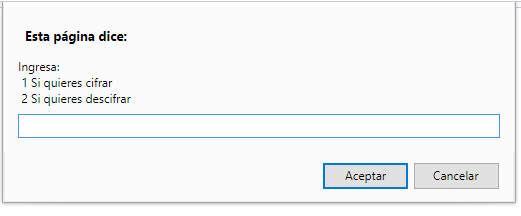
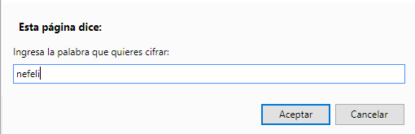
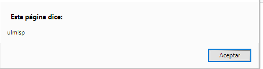
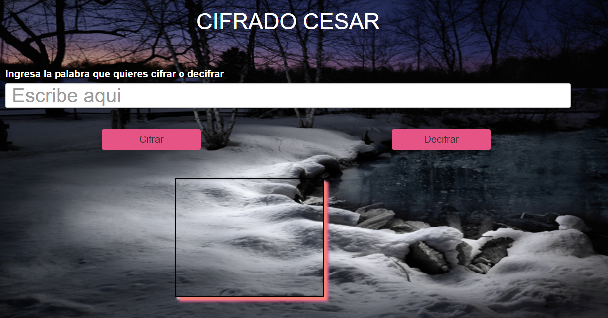
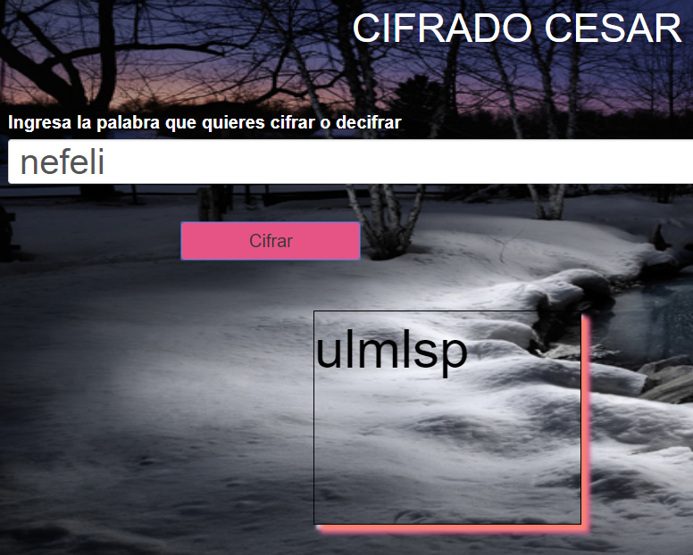

#Cifrado cesar

##OBJETIVO

Deben pasar el cifrado cesar de javascript 5 a ES6 manualmente.

- Actualicen la vista del cifrado cesar: recuerden que esa vez usaron alertas, sin embargo deben actualizar eso a  un input donde ingresar los datos y un botón que ejecute la función, el resultado se debe mostrar en la pantalla.

**Enlazando Repositorio anterior**

[ES5.js](https://github.com/Nefelijm/caesar-cipher)
__________________________________________________________________________________________________
**Con javascript ES5**
__________________________________________________________________________________________________

_________________________________________________________________________________________________

_________________________________________________________________________________________________

_________________________________________________________________________________________________
##CODIGO QUE PERMITIRA DAR FUNCIONALIDAD EN ES5 Y ES6
~~~
  for (var i = 0; i < valueInput.length; i++) {
        let toAscci = valueInput.charCodeAt(i);
        let toAscci2 = valueInput[i];
        if ((toAscci >= 65) && (toAscci <= 90)) {
          toAscci2 = String.fromCharCode(((toAscci - 65 - 7 + 52) % 26) + 65);
        } else if ((toAscci >= 97) && (toAscci <= 122)) {
          toAscci2 = String.fromCharCode(((toAscci - 97 - 7 + 52) % 26) + 97);
        }
        decipher += toAscci2;
      }
~~~
__________________________________________________________________________________________________
**Con javascript ES6**

_________________________________________________________________________________________________

_________________________________________________________________________________________________

_________________________________________________________________________________________________

##HERRAMIENTAS UTILIZADAS

1.html5
__________________________________________________________________________________________________
2.css3
__________________________________________________________________________________________________
3.jquery
__________________________________________________________________________________________________
4.bootstrap
__________________________________________________________________________________________________
5.Es6

##CONOCIMIENTOS NECESARIOS (FUNDAMENTOS JAVASCRIPT)

1. let & var
__________________________________________________________________________________________________
2. const
__________________________________________________________________________________________________
3. => arrow functions
__________________________________________________________________________________________________
4. fromCharCode() & charCodeAt()

